##  Bryn AI

An on-device, privacy-first browser assistant that understands why you browse, groups activity into Intents, and proactively suggests next steps. Built on a Collect → Queue → Analyze model so UI stays responsive while AI runs in the background.

### Key features

> Jump to [screenshots](#screenshots).

- **Intent understanding**: Groups related pages into human-readable "Intents" and refreshes them over time.
- **Proactive suggestions**: Surfaces actionable next steps (resume, compare, explore) based on intent state.
- **Asynchronous AI**: Background queue with prioritization, dependencies, and retries.
- **Fully local**: Chrome built‑in AI only, IndexedDB storage, no telemetry.

### Prerequisites

- Chrome 138+ with Built‑in AI (Gemini Nano) available.
- Extension permissions per `public/manifest.json` (including `sidePanel`, `alarms`, `history`, `unlimitedStorage`).

### Install and load (quick start)

1. Install deps and build

```bash
npm install
npm run build
```

2. Load the extension

- Open `chrome://extensions` → Enable Developer mode → "Load unpacked" → select the `dist/` folder.

### How to use

1. Open the Side Panel for Bryn AI (from the toolbar or `chrome://extensions` → open in side panel).
2. Browse normally. The content script logs page metadata and interactions; pages appear in the app within seconds.
3. Use the Backstage and Developer Hub to see what Bryn is working on (queue, pages, intents).
4. Open an intent to see pages, analysis, and actions. Regenerate analysis or mark as completed when appropriate.

### How to test

1. Open Developer Hub → Scenario Runner.
2. Select a scenario and Run. Watch live logs to track background tasks.
3. Open Task Queue to inspect queued/processing/completed tasks, then drill into details.

### Documentation

- 01 — Product: `docs/01-product.md`
- 02 — Architecture: `docs/02-architecture.md`
- 03 — Installation & Usage: `docs/03-installation-and-usage.md`
- 04 — Testing: `docs/04-testing.md`
- 05 — Data Model: `docs/05-data-model.md`
- 06 — Processing Queue: `docs/06-processing-queue.md`
- 07 — Privacy & Permissions: `docs/07-privacy-and-permissions.md`
- 08 — UI Guide: `docs/08-ui-guide.md`
- 09 — Troubleshooting: `docs/09-troubleshooting.md`
- 10 — Contributing: `docs/10-contributing.md`

### Screenshots

#### Main Hub

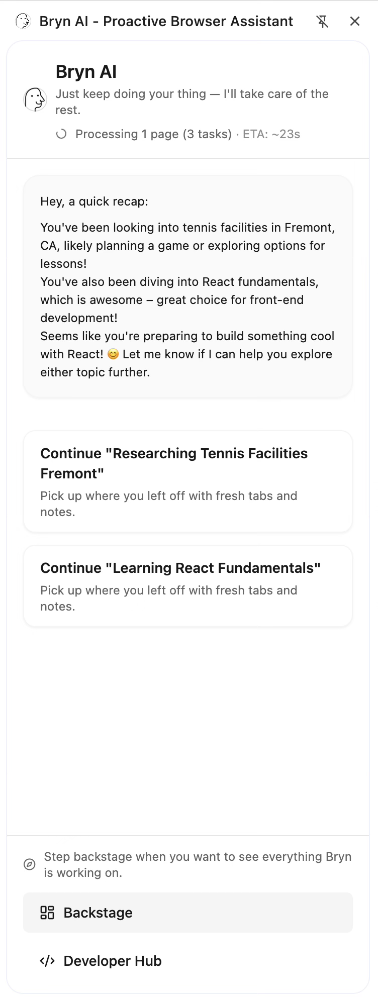

#### Processing Queue Tab

<div>
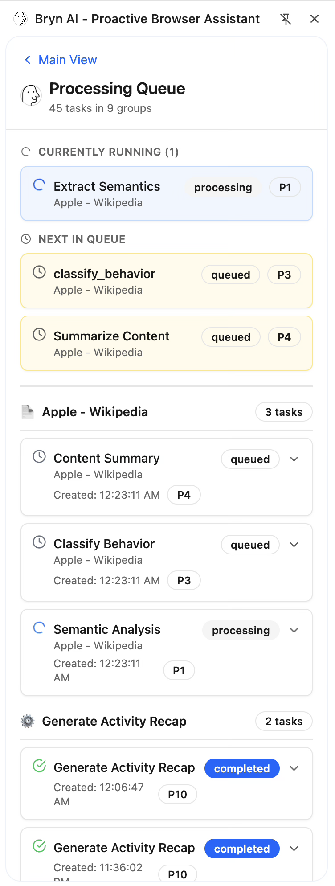

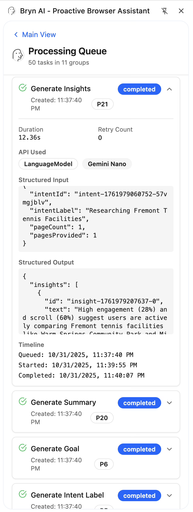
</div>

#### Backstage Hub

<div>
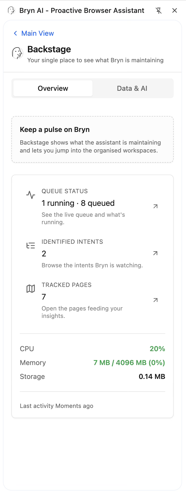

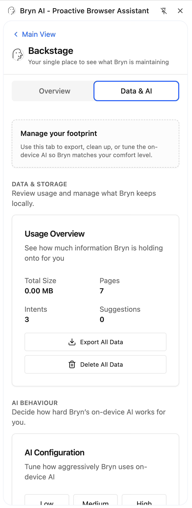

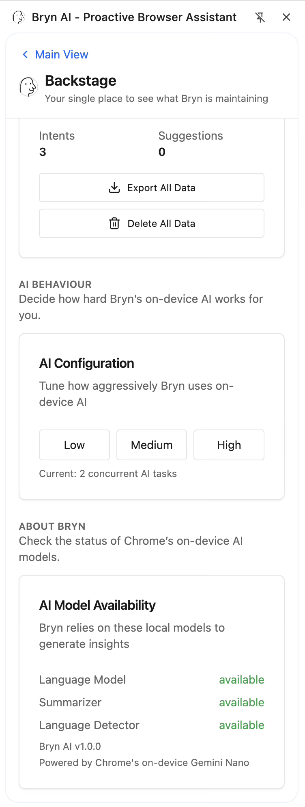
</div>

#### Detected Intents & Intent Details

<div>
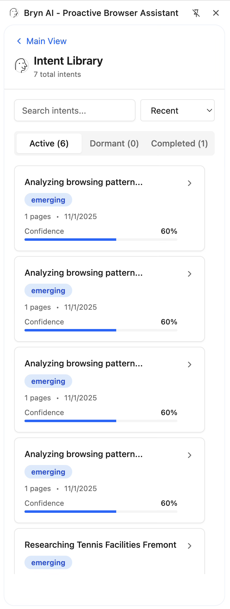

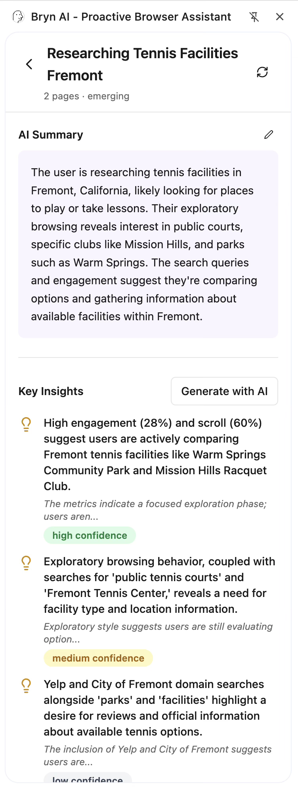

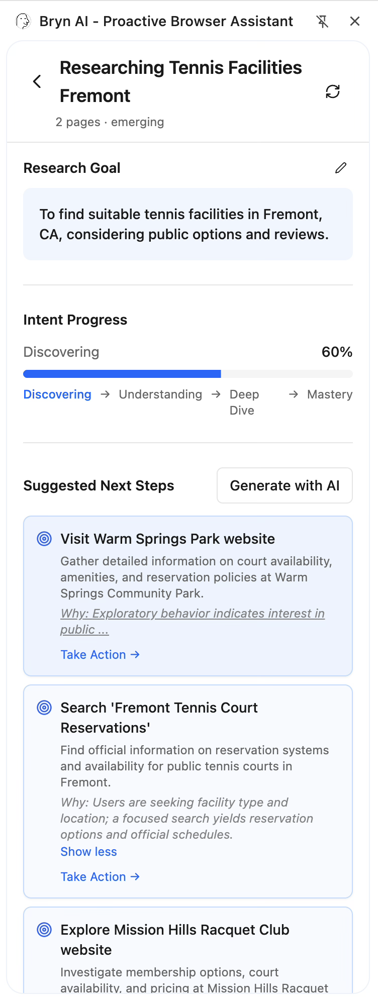

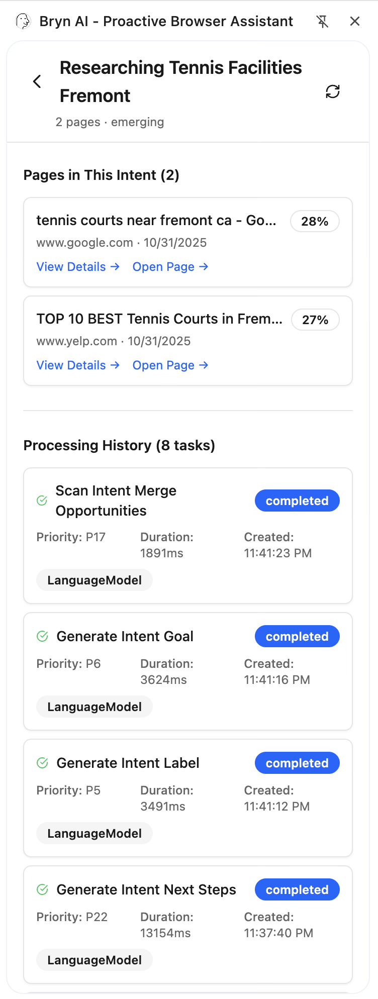
</div>

#### Page History & Page Details

<div>
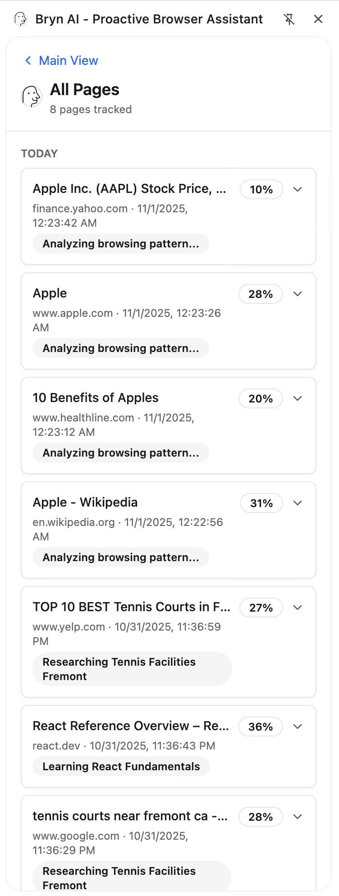

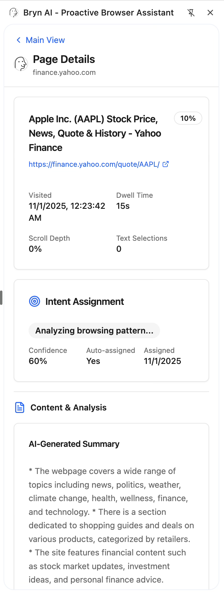

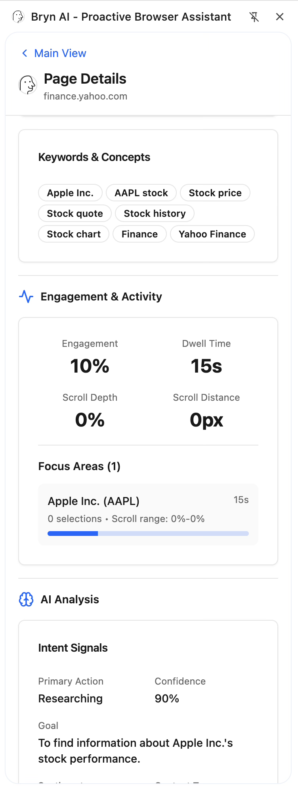

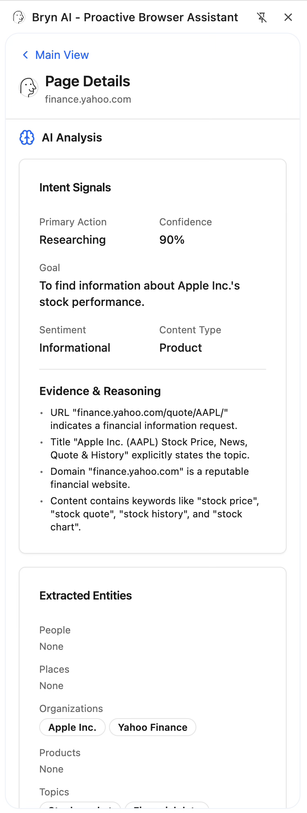

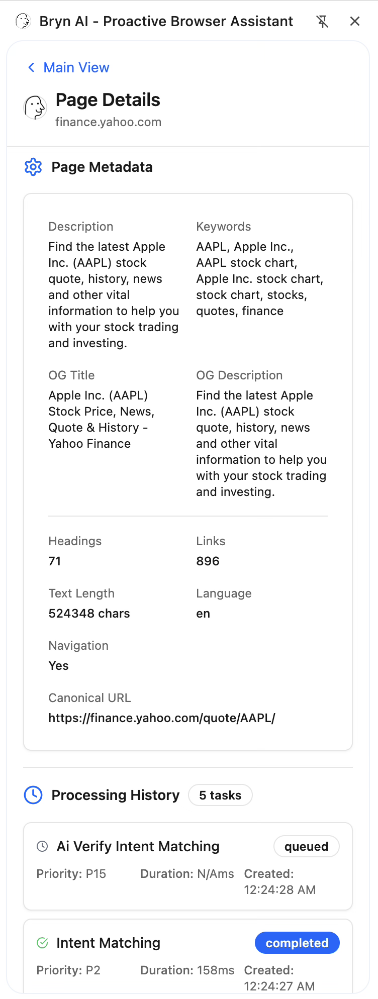
</div>

#### Developer Hub & Scenario Runner Tab

<div>
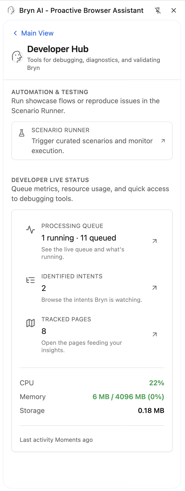
  
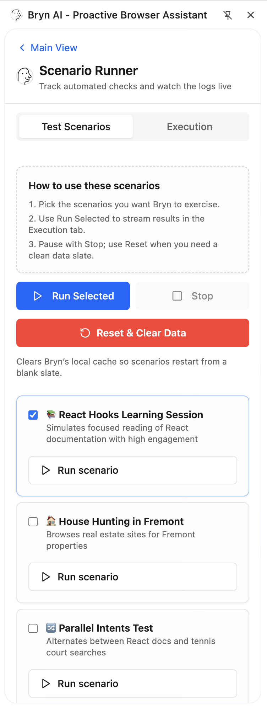

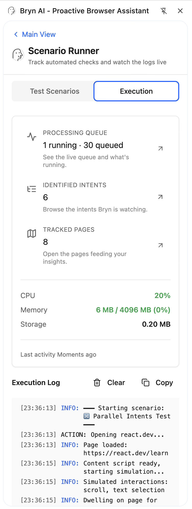
</div>
